# Laboratory-2 Project-Report
A comparative study of the von Heijne statistical model and an SVM-based classifier for signal peptide prediction under strictly controlled biological conditions.

## Project Overview

This project systematically compares a classical position-specific statistical model (von Heijne) and a machine learning model (Support Vector Machine, SVM) for eukaryotic signal peptide prediction.  
A carefully curated UniProtKB dataset was constructed to ensure that the **only systematic difference between positive and negative samples is the presence of a signal peptide**, minimizing biological confounding factors.

## Dataset Construction and Characteristics

All sequences were derived from manually reviewed UniProtKB entries and restricted to eukaryotic proteins. Redundancy was removed using MMseqs2 prior to model training and evaluation.

### Taxonomic Distribution

The taxonomic composition of signal peptide–positive samples is highly consistent between the training set and the independent benchmark test set, indicating no species bias introduced by data splitting.

  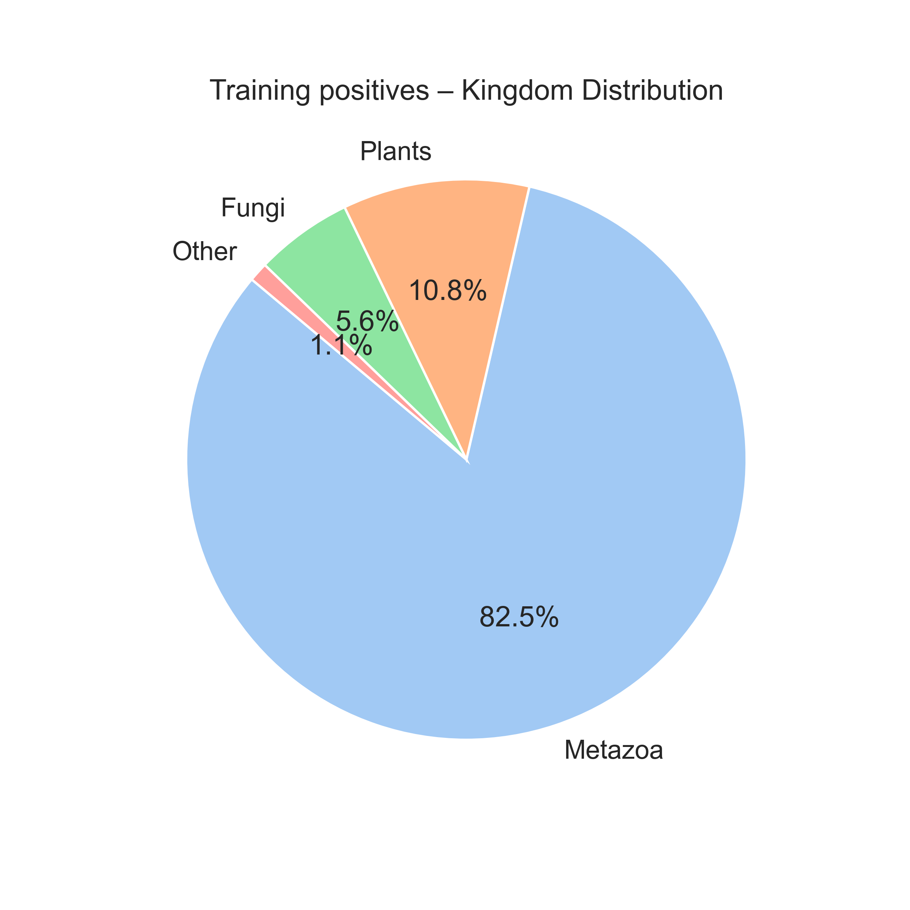
  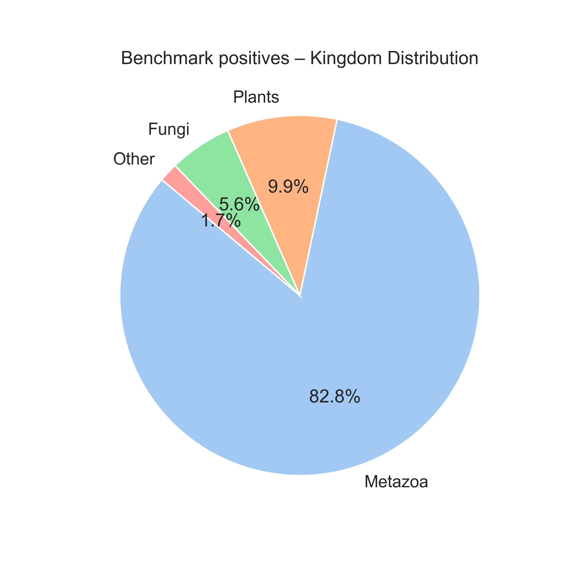

<em>Fig. 1. Taxonomic (kingdom-level) distribution of signal peptide–positive samples in the training and benchmark datasets.</em>

Species-level distributions further confirm similar composition patterns between training and benchmark datasets.

  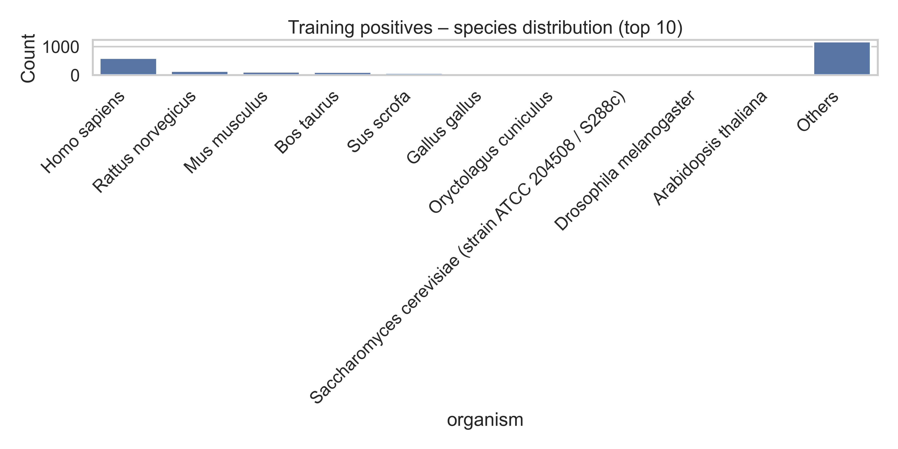
  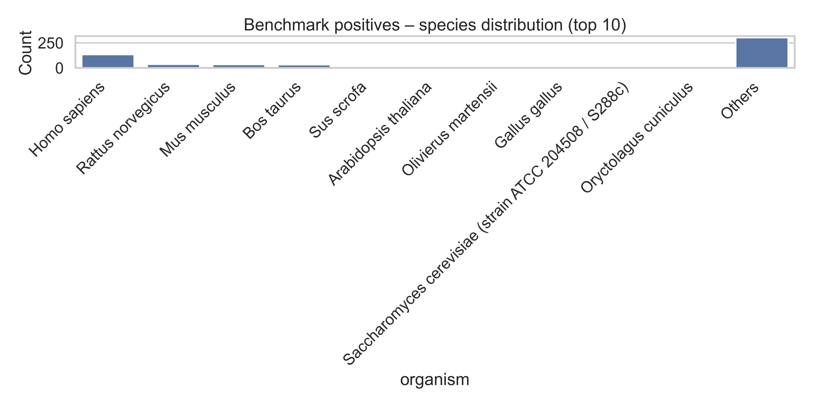

<em>Fig. 2. Species-level distribution of signal peptide–positive samples in the training and benchmark datasets.</em>

### Signal Peptide Length Distribution

Signal peptide lengths are mainly concentrated between 15 and 30 amino acids, with highly consistent distributions across training and benchmark sets.

  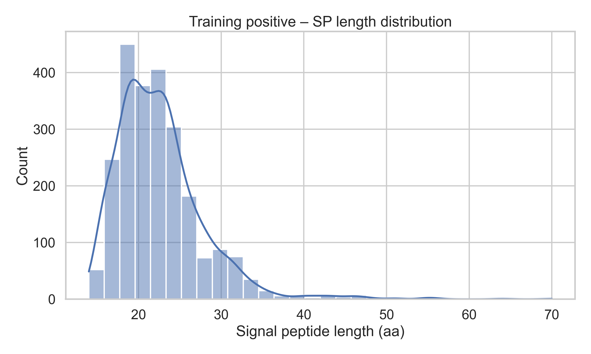
  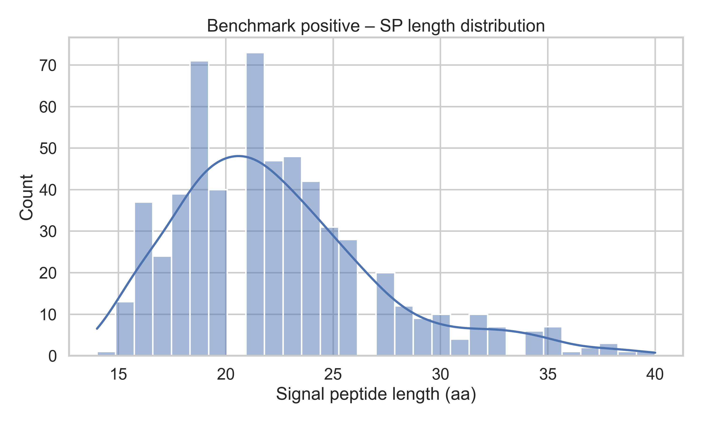

<em>Fig. 3. Length distribution of signal peptides in the training and benchmark datasets.</em>

### Full-Length Protein Length Characteristics

Positive and negative samples show distinct full-length protein length distributions. Negative samples tend to include longer proteins, a trend consistently observed in both datasets.

  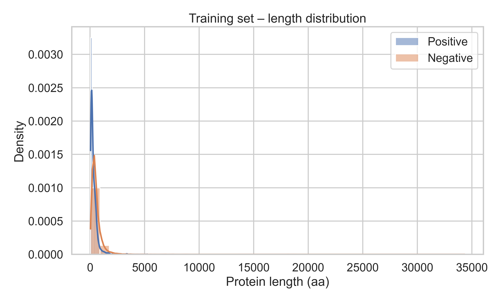
  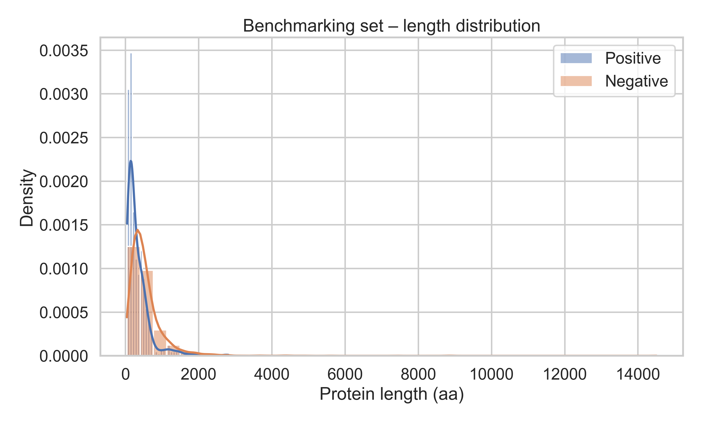

<em>Fig. 4. Kernel density estimation of full-length protein length distributions in the training and benchmark datasets.</em>

  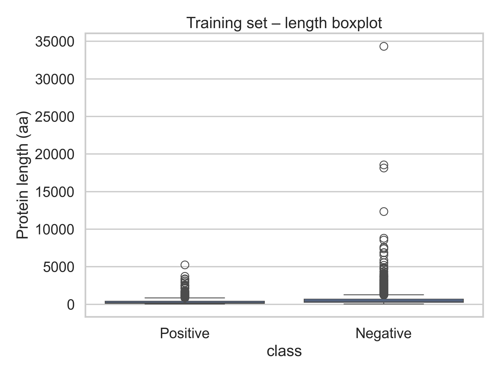
  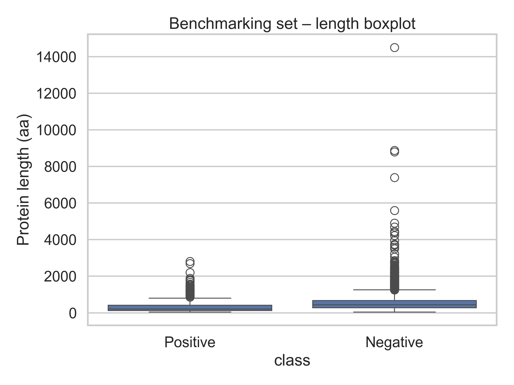

<em>Fig. 5. Boxplot comparison of full-length protein lengths between training and benchmark datasets.</em>

### Amino Acid Composition

Signal peptide regions exhibit strong enrichment of hydrophobic amino acids compared with the SwissProt background, consistent with classical biological characteristics of signal peptides.

  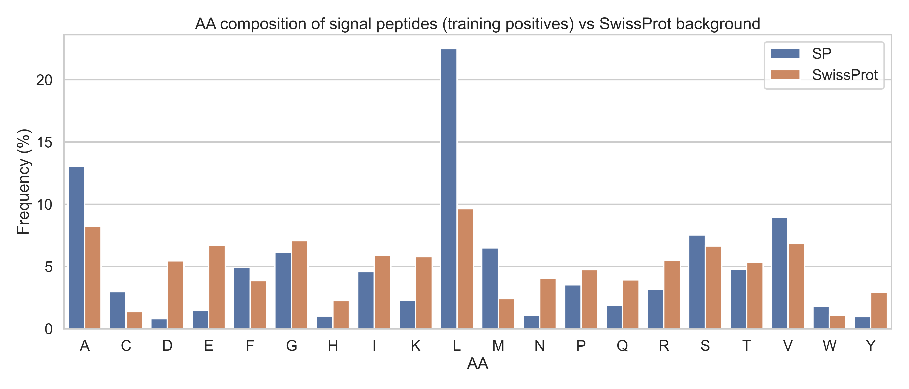

<em>Fig. 6. Amino acid composition of signal peptide regions compared with the SwissProt background.</em>

## Model Implementation

- **von Heijne model**  
  A position-specific weight matrix (PSWM) was constructed based on experimentally validated cleavage sites and applied via sliding-window scanning of N-terminal regions.

- **SVM model**  
  Signal peptide prediction was formulated as a binary classification task using N-terminal amino acid composition and hydrophobicity-related features. Model parameters were optimized via five-fold cross-validation.

## Experimental Results

### Overall Performance Comparison

Both models achieve strong predictive performance on the independent benchmark test set. The SVM model shows improved false positive control, while the von Heijne model maintains strong biological interpretability.

  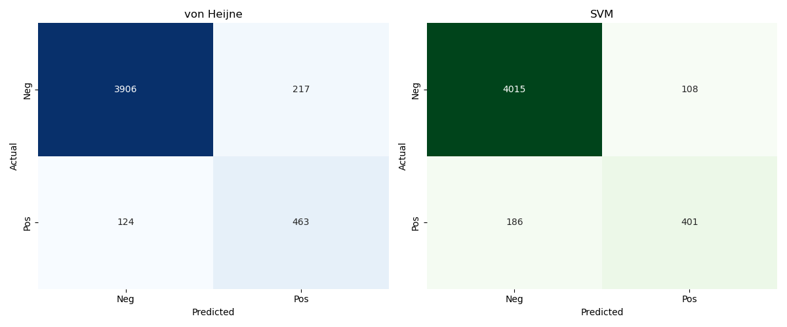

<em>Fig. 7. Confusion matrix comparison between the von Heijne model and the SVM classifier on the benchmark dataset.</em>

### Interpretation of von Heijne Model Features

The learned PSWM clearly captures classical signal peptide features, including a positively charged N-region, a hydrophobic H-region, and cleavage site preferences consistent with the (-3, -1) rule.

  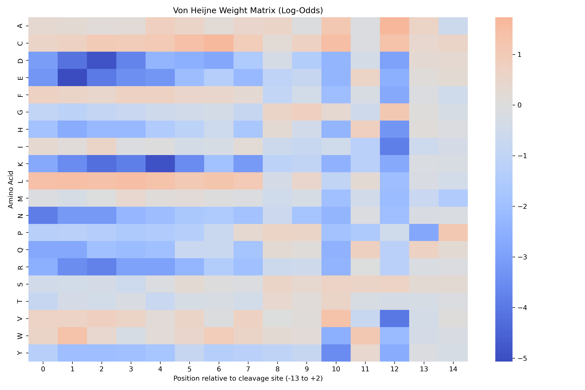

<em>Fig. 8. Position-specific weight matrix (PSWM) learned by the von Heijne model.</em>

Sequence logo analysis shows that false negative samples tend to have weaker hydrophobic cores despite retaining partial cleavage site signals.

  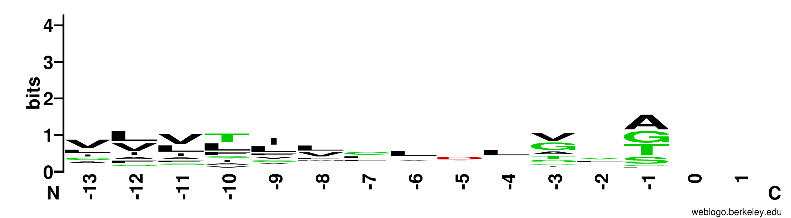

<em>Fig. 9. Sequence logo of false negative predictions produced by the von Heijne model.</em>

### Impact of Transmembrane Helices on False Positives

Transmembrane helices are a major source of false positive predictions, particularly for hydrophobicity-driven models. The SVM model reduces, but does not fully eliminate, this interference.

  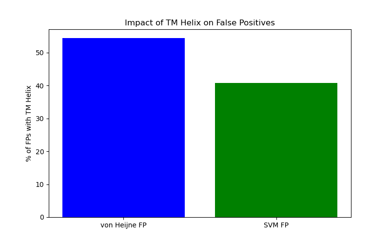

<em>Fig. 10. Analysis of false positive predictions associated with transmembrane helices.</em>

## Conclusion

This project demonstrates that classical statistical models and machine learning approaches exhibit complementary strengths in signal peptide prediction.  
The von Heijne model provides strong biological interpretability, while the SVM model improves specificity by integrating multiple sequence-level features.  
These results highlight the importance of combining biological prior knowledge with machine learning methods for robust protein sequence analysis.

## Repository Notes

Temporary files generated during MMseqs2 clustering and notebook execution are excluded via `.gitignore`.  
All figures shown above are generated directly from the analysis notebooks included in this repository.
